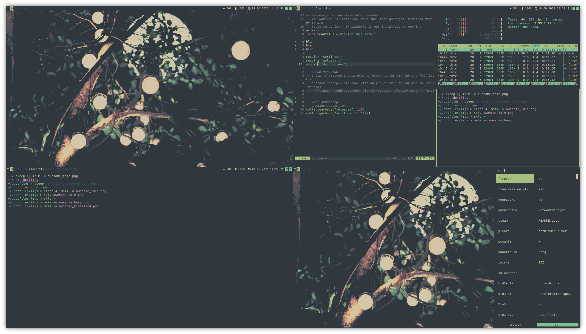

= Welcome to my dotfiles!
chtc <notnotcha0t1c@protonmail.com>
{docdate}
:toc: macro
:toc-title:
:icons: font

These are my [.line-through]#horrible# *awesome* dotfiles.

Screenshots are located in the link:imgs[imgs] folder and shown in README's.

[CAUTION]
====
You probably _will_ and *must* change something in my dotfiles.

I recommend looking through these dotfiles and changing things to fit your setup if you want to use this.
====

.*Table Of Contents*
[%collapsible]
====
toc::[]
====

== Contains
[horizontal]
link:config/alacritty/[alacritty]:: terminal
link:config/awesome/[awesome]:: window manager
link:config/mpd/[mpd]:: music daemon
link:config/ncmpcpp[ncmpcpp]:: music player
link:config/nvim/[nvim]:: text editor
link:config/rofi/[rofi]::  window switcher/application launcher/dmenu replacement
link:config/sxiv/exec/[sxiv]:: image viewer
link:config/user-dirs.dirs[xdg dirs]:: some directory thingy
link:xinitrc[xinitrc]:: launch the window manager and some programs
link:Xresources[xresources]:: i only set colors in this
link:config/zathura/[zathura]:: pdf reader
link:config/zsh/[zsh] (link:zshenv/[zshenv]):: shell
link:local/bin/[scripts]:: scripts used by stuff
link:local/share/fonts[fonts]:: used by everything that has a font setting in here

https://github.com/sainnhe/everforest[*colorscheme*]

== Dependencies
If something requires something, it will be written in it's README or here.

* https://github.com/source-foundry/Hack/releases/download/v3.003/Hack-v3.003-ttf.zip[Hack]footnote:font[You only need to download this manually, if you didn't clone the whole repo]
* https://github.com/ryanoasis/nerd-fonts/tree/master/patched-fonts/Hack[Hack Nerd Font]footnote:font[]

== Install
Want to use everything?
This is how you install this.

Step 1:: Clone the repository.
[source,sh]
----
git clone --recurse-submodules https://gitlab.com/cha0t1c/dotfiles.git $HOME/.dotfiles
----

Step 2:: Install https://github.com/thoughtbot/rcm[rcm].

Step 3:: Install dependenciesfootnote:[Look at readme's]footnote:[Install command(s) for everything coming soon]

Step 4:: Install the dotfiles with rcm.
[source,sh]
----
RCRC=$HOME/.dotfiles/rcrc rcup
----
