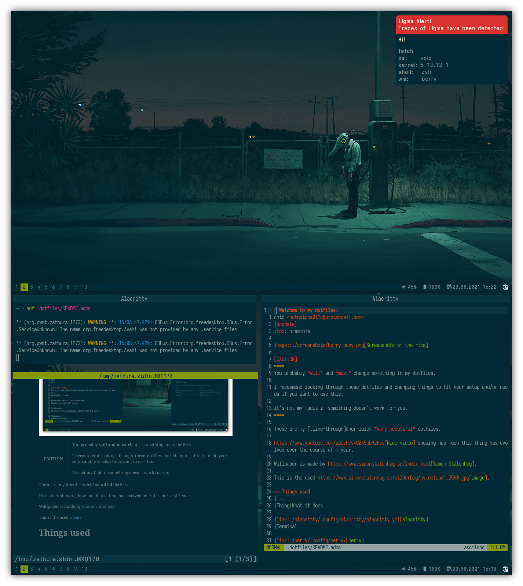

= Welcome to my dotfiles!
chtc <notnotcha0t1c@protonmail.com>
{docdate}
:toc: preamble

[CAUTION]
====
You probably *will* and *must* change something in my dotfiles.

I recommend looking through these dotfiles and changing things to fit your setup and/or needs if you want to use this.
====

These are my [.line-through]#horrible# *awesome* dotfiles.

== Things used
|===
|Thing|What it does

|link:./alacritty/.config/alacritty/alacritty.yml[alacritty]
|Terminal

|link:./awesome/.config/awesome/[awesome]
|Window Manager

|link:./emacs/.config/doom/[doom emacs]
|Emac

|link:./mpd/.config/mpd/mpd.conf[mpd]
|Music player daemon

|link:./ncmpcpp/.config/ncmpcpp/[ncmpcpp]
|Music player

|link:./nvim/.config/nvim/[nvim]
|Text editor

|link:./rofi/.config/rofi/[rofi]
|Application launcher

|link:./sxiv/.config/sxiv/exec/key-handler[sxiv]
|Image viewer

|link:./x11/.config/X11/[x11]
|.xinitrc and .Xresources

|link:./xdg/.config/user-dirs.dirs[xdg dirs]
|Some directory thingy

|link:./zathura/.config/zathura/zathurarc[zathura]
|PDF reader

|link:./zsh/.config/zsh/[zsh] (link:./zsh/.zshenv[zshenv])
|Shell

|link:./fonts/.config/fontconfig/fonts.conf[fonts]
|Font configuration

|link:./scripts/.local/bin/[scripts]
|Scripts used by me

|https://github.com/morhetz/gruvbox[gruvbox]
|Colorscheme
|===

== Dependencies
If something requires something, it will be written in it's REDME or here.

- doas
- https://github.com/be5invis/Iosevka/releases[Iosevka & Iosevka Aile]
- https://github.com/ryanoasis/nerd-fonts/releases[Hack Nerd Font]

== How To Install
Step 1:: Clone the repository

[source,shell]
git clone --recurse-submodules https://github.com/notchtc/dotfiles.git "$HOME"/.dotfiles

Step 2:: Install https://www.gnu.org/software/stow/[GNU stow]
Step 3:: Install dependencies.
Step 4:: Enter the dotfiles directory.

[source,shell]
cd "$HOME"/.dotfiles

Step 5:: Install the dotfiles with GNU stow.

- If you want to isntall everything do this:

[source,shell]
stow alacritty awesome emacs fonts mpd ncmpcpp nvim rofi scripts sxiv x11 xdg zathura zsh

- If you want just one/few things for example: alacritty and zsh, you would do:

[source,shell]
stow alacritty zsh
