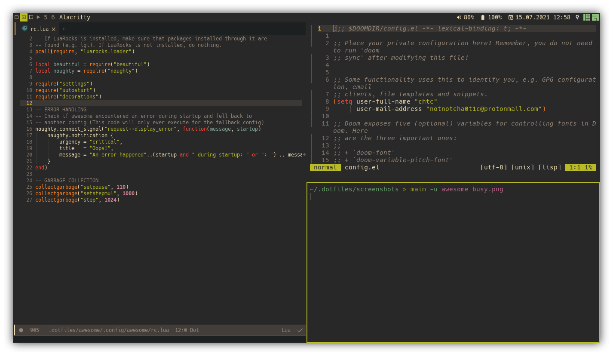
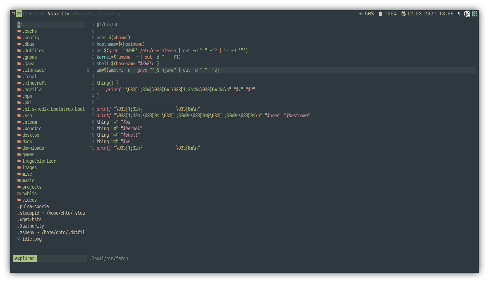
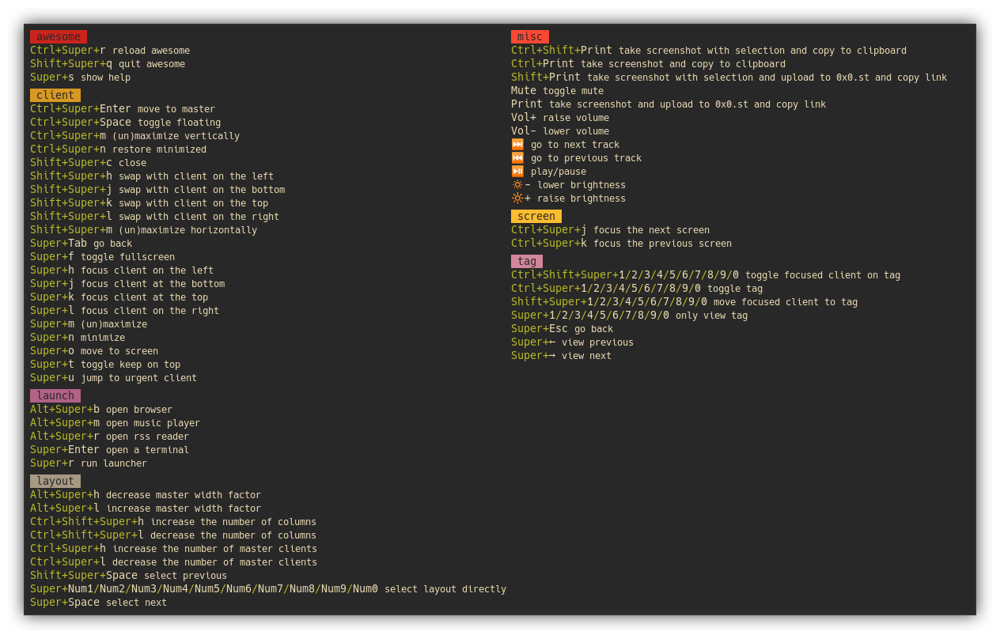

= https://awesome.org[awesome]
chtc <notnotcha0t1c@protonmail.com>
{docdate}
:toc: preamble
:experimental:

IMPORTANT: Requires Awesome git!

My epic gamer Awesome config.

== Dependencies
|===
|Dependency|Why?

|acpi
|Make battery widget work

|link:../../../scripts/.local/bin/ask[ask]
|Asking if you want to shutdown/reboot

|alacritty
|Terminal

|pamixer
|Change volume

|chromium
|Browser

|gnome-calendar,pkill
|Calendar

|maim
|Screenshot tool

|lollypop
|Music player

|newsboat
|RSS reader

|playerctl
|Control media players

|rofi
|Application launcher (and also a dmenu replacement and window switcher)

|xbacklight
|Control screen brightness
|===

=== Autostart
There are some things launched at start in link:./settings/autostart.lua[].

You probably want to add/remove/change some stuff here.

If you want to remove the autostart completely, just remove/comment out the require line in file:./rc.lua and delete the file if you want.

|===
|Thing launched|Why?

|xrdb
|Load xresources at startup

|pulseaudio
|I don't trust pulseaudio being launched when needed

|redshift-gtk
|Saving my eyes

|mpd
|Music Player Daemon

|emacs
|Emacs Daemon
|===

== Keybindings
When using Awesome you can just do kbd:[Super+s]

== Other
If power and reboot isn't working do https://gitlab.com/-/snippets/2042640[this].
