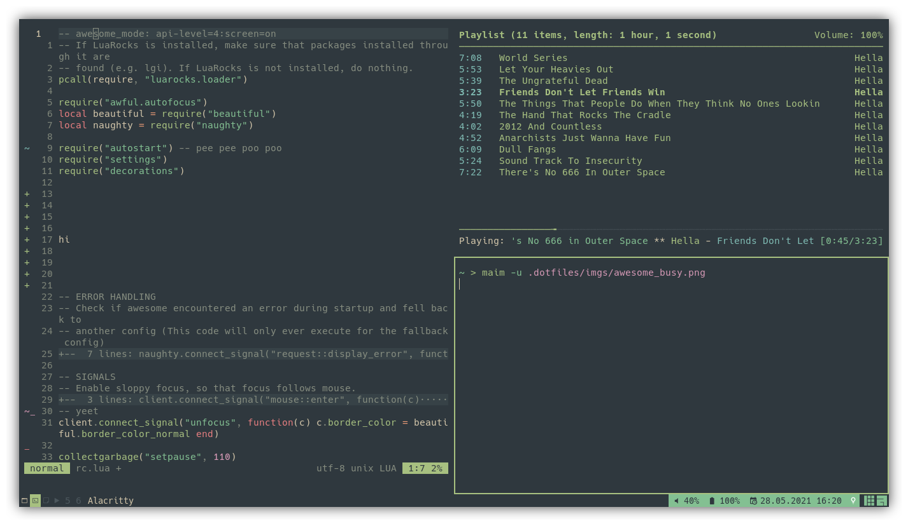
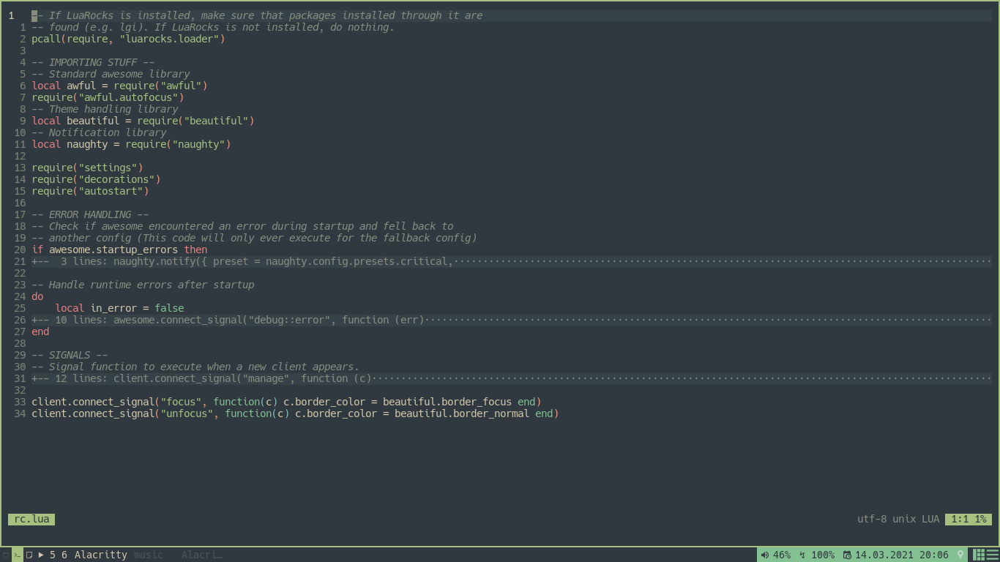
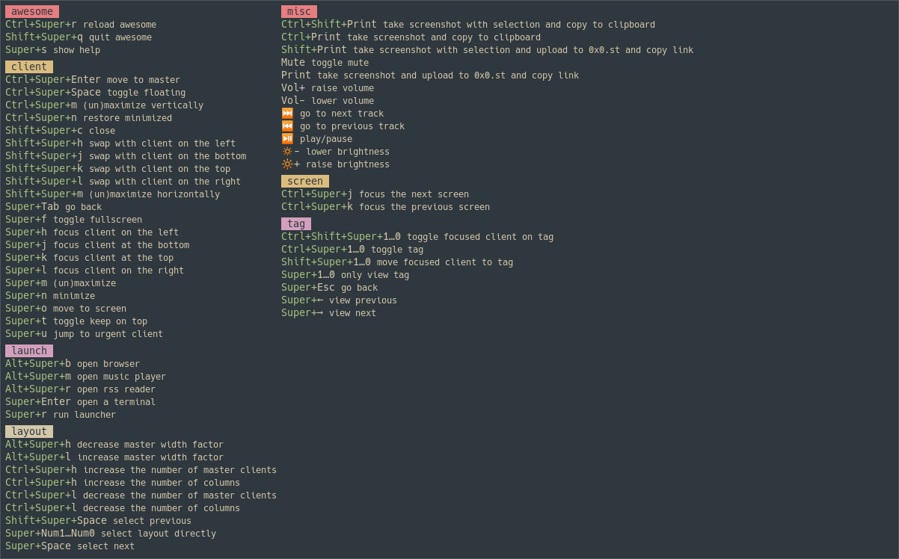

= link:awesomewm.org[awesome]
cha0t1c <notnotcha0t1c@protonmail.com>
{docdate}
:toc:
:experimental:

IMPORTANT: Requires awesome git.

My amazing awesomewm config.

link:wall.png[Wallpaper] (Made using https://github.com/ngynLk/ImageColorizer[ImageColorizer])

https://unsplash.com/photos/AULwJzIhDRQ[Original wallpaper]

== Screenshots

== Dependencies
|===
|Dependency|Why?

|acpi
|Make battery widget work

|link:../../local/bin/ask[ask]
|Asking if you want to shutdown/reboot

|alacritty
|Terminalfootnote:change[You can change this in settings/vars.lua]

|pamixer
|Change volumefootnote:change2[You can change this in settings/keys.lua] & make volume widget work

|firefox
|Browserfootnote:change[]

|maim
|Screenshot toolfootnote:change[]

|mpc
|Control mpd

|ncmpcpp
|Music playerfootnote:change[]

|newsboat
|RSS readerfootnote:change[]

|rofi
|Application launcher (and also a dmenu replacement and window switcher)footnote:change[]

|xbacklight
|Control screen brightnessfootnote:change2[]

|===

=== Autostart
There are some things launched at start (link:./autostart.lua[autostart.lua]).
You probably want to add/remove/change some stuff here.footnote:[If you want to remove the autostart completely, just remove/comment out the require line in rc.lua and delete the file if you want.]

|===
|Thing launched|Why?

|xrdb
|Load xresources at startup

|pulseaudio
|I don't trust pulseaudio being launched when needed

|mpd
|It plays audio and ncmpcpp requires it

|mpdnotify
|Notifications for mpd

|redshift-gtk
|Saving my eyes

|===

== Keybindings
When using awesomewm you can just do kbd:[Super+S].

== Other
If poweroff and reboot isn't working do https://gitlab.com/-/snippets/2042640[this].
