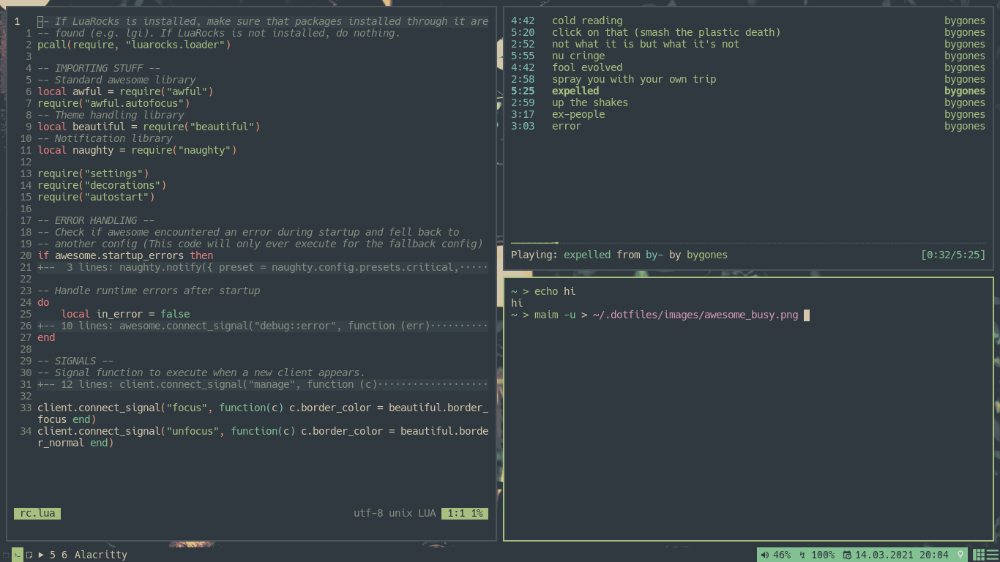

= link:awesomewm.org[awesome]
cha0t1c <notnotcha0t1c@protonmail.com>
{docdate}
:toc:
:experimental:

My awesomewm config.

link:../../images/wallpaper.png[Wallpaper]
https://unsplash.com/photos/AULwJzIhDRQ[Original wallpaper]

== Screenshots
image:../../images/awesome_idle.png[Idle screenshot of awesome]

image:../../images/awesome_minimized.png[Busy screenshot of awesome with one window minimized]

== Dependencies
You probably want to change these.
There are also somethings launched in autostart.lua so you may want to remove some of them or remove the file completelyfootnote:["If you are removing the file remember to also remove the require in rc.lua"] or change something.

|===
|Dependency|Why?

|link:../../local/bin/ask[Ask]
|Asking if you want to shutdown/reboot

|Alacritty
|Terminal

|Pavucontrol
|Mixer to open

|Alsa-utils
|Change volume/make volume widget work

|Firefox
|Browser to open

|Maim
|Take screenshots

|Playerctl
|Control media playersfootnote:["If you use mpd you either want to install mpDris2 or replace this with mpc"]

|Ncmpcpp
|Music player to open

|Newsboat
|RSS reader to open

|Rofi
|Application launcher (and also a dmenu replacement and window switcher)

|Viciousfootnote:["Will be installed when cloning repo with --recurse-submodules"]
|More widgets! (I'm too stupid and lazy to make my own)

|Xbacklight
|Control screen brightness

|===

== Keybindings
When using awesomewm, you can just do kbd:[Super+S].
image:../../images/awesome_keybindings.png[Awesome keybindings]

* Volume widget
** LMB to toggle mute
** RMB to open mixer
** Scroll up to raise volume
** Scroll down to lower volume

== Other
If poweroff and reboot isn't working, do https://gitlab.com/-/snippets/2042640[this].
