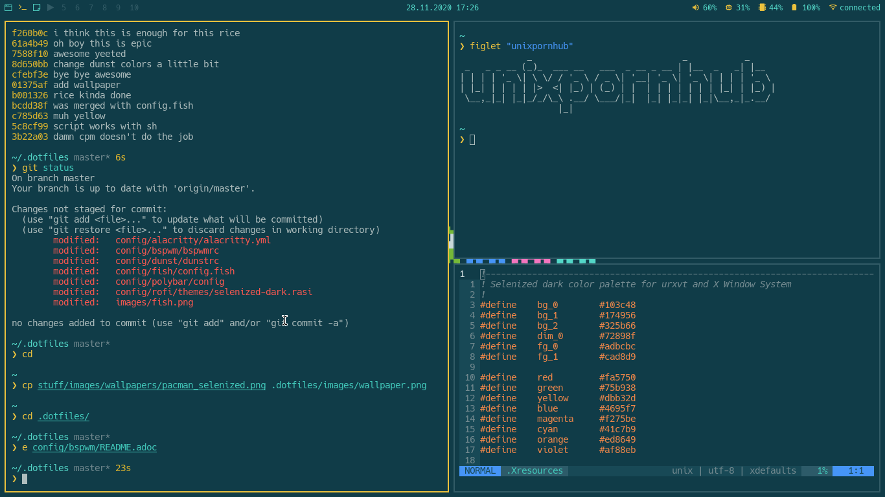
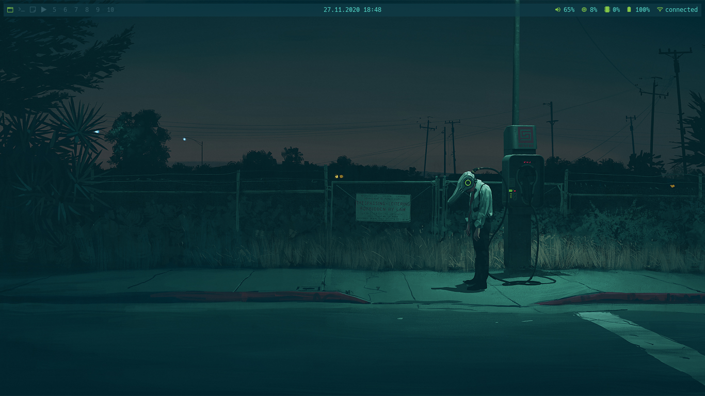

# [bspwm](https://github.com/baskerville/bspwm)
My personal bspwm config, it isn't supposed to be the most productive thing in the world.
[[_TOC_]]

## Screenshots

## Keybindings
|Keybind                                                |What it does                                                                          |
|-------------------------------------------------------|--------------------------------------------------------------------------------------|
|Super + Escape                                         |reloads sxhkd config                                                                  |
|Super + Enter                                          |Opens terminal (alacritty)[^1]                                                        |
|Super + Space                                          |Open program launcher (rofi)[^1]                                                      |
|XF86AudioRaiseVolume/XF86AudioLowerVolume/XF86AudioMute|Raise/lower/mute volume (pamixer)[^1]                                                 |
|XF86AudioPlay/XF86AudioNext/XF86Prev                   |Play/Pause/Go to next/previous for example: song in your media player (playerctl)     |
|(Shift +) PrintScreen                                  |Screeshot selection/Screenshot whole screen and copy to clipboard (maim)[^1]          |
|Super + Alt + (Shift +) X                              |Reboot/Poweroff your computer                                                         |
|                                                       |                                                                                      |
|Super + Alt + (Q/R)                                    |Quit/Restart bspwm                                                                    |
|Super + (Shift +) C                                    |Close/Kill window                                                                     |
|Super + (T/Shift + T/S/F)                              |Set window state (Tiled/Pseudo Tiled/Floating/Fullscreen)                             |
|Super + (Shift +) H/J/K/L                              |Focus window in the given direction (Left/Down/Up/Right)                              |
|Super + (Shift +) 1-9/0                                |Focus or send to the given desktop (1-10)                                             |
|Super + Alt + H/J/K/L                                  |Expand a window by moving one of its side outward (Left/Down/Up/Right)                |
|Super + Alt + Shift + H/J/K/L                          |Contract a window by moving one of its side inward (Left/Down/Up/Right)               |
|Super + Left/Down/Up/Right                             |Move a floating window                                                                |
[^1]: You can easily change this to whatever you want.

## Dependencies
|Dependency            |What it does     |
|----------------------|-----------------|
|[sxhkd](../sxhkd/)    |Keybinds         |
|nitrogen              |Setting wallpaper|
|[polybar](../polybar/)|Bar with info    |
|[dunst](../dunst/)    |Notifications    |
|[picom](../picom/)    |Compositor       |
