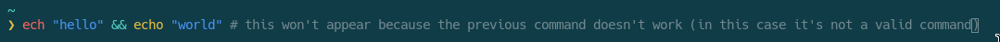

# [fish](https://fishshell.com)
My personal fish config that doesn't look too crazy and doesn't have thousands of things.

[[_TOC_]]

## Screenshot

## Functions
|Function|What it does                                                    |
|--------|----------------------------------------------------------------|
|cat     |Use [bat](https://github.com/sharkdp/bat)[^1] instead of cat[^2]|
|e       |Launch editor (nvim)[^1]                                        |
|ls      |Use [lsd](https://github.com/Peltoche/lsd)[^1] instead of ls[^2]|
|se      |Launch editor with sudo (nvim)[^1]                              |
|setwal  |Sets wallpaper for awesomewm[^2]                                |
|xi      |Install package with xbps                                       |
|xup     |Update packages with xbps                                       |
|xr      |Remove package with xbps                                        |
|xrs     |Search the xbps repository                                      |

## Other
- Adds $HOME/.local/bin to PATH
- Cleaning up the home directory
  - Applications
    - Sets BROWSER to firefox[^1]
    - Sets EDITOR to nvim[^1]
    - Sets SXHKD\_SHELL to sh[^1]
  - Makes lesshist not appear
  - Moves inputrc to $XDG\_CONFIG\_HOME/readline/input
  - XDG
    - Sets XDG\_DATA\_HOME to $HOME/.local/share
    - Sets XDG\_CONFIG\_HOME to $HOME/.config
    - Sets XDG\_CACHE\_HOME to $HOME/.cache
    - Sets XDG\_DESKTOP\_DIR to $HOME/stuff/desktop
    - Sets XDG\_TEMPLATES\_DIR to $HOME/stuff/misc
    - Sets XDG\_PUBLICSHARE\_DIR to $HOME/stuff/pshare
    - Sets XDG\_DOCUMENTS\_DIR to $HOME/stuff/docs
    - Sets XDG\_MUSIC\_DIR to $HOME/stuff/music
    - Sets XDG\_PICTURES\_DIR to $HOME/stuff/images
    - Sets XDG\_VIDEOS\_DIR to $HOME/stuff/videos 
- Disable fish greeting
- Fish default colorscheme made to use terminal colors (.config/fish/conf.d/term.fish)[^2]
- Vi keybindings

[^1]: You can change this easily
[^2]: Feel free to remove this
