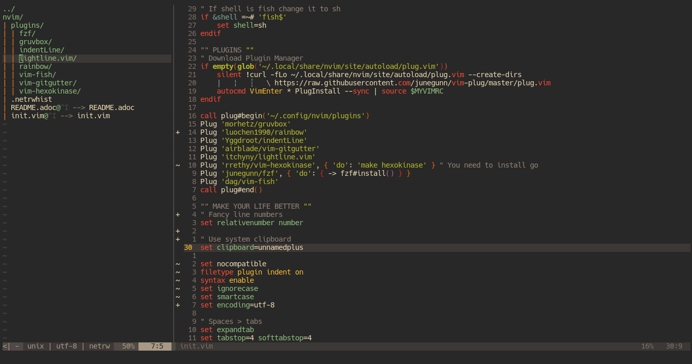

= https://neovim.io[Neovim]
v1.1, Cha0t1c <notnotcha0t1c@protonmail.com>
{docdate}
:toc:

== Screenshot

== Plugins
|===
|Plugin|What it does

|vim-fish
|Vim support for fish

|indentLine
|Display indentation levels

|vim-gitgutter
|Shows git changes

|gruvbox
|gruvbox colorscheme

|lightline.vim
|Fancy bar at bottom

|vim-css-color
|Highlight colors

|===

== Features
* A comment isn't placed when making an newline
* Clipboard that works between different applications
* Removing trailing newlines
* Reload config after editing
** neovim
** Xresources
