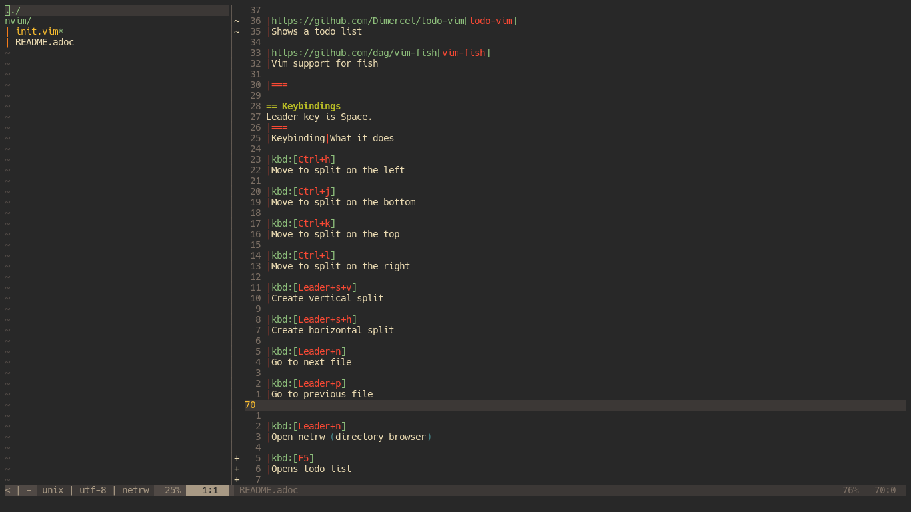
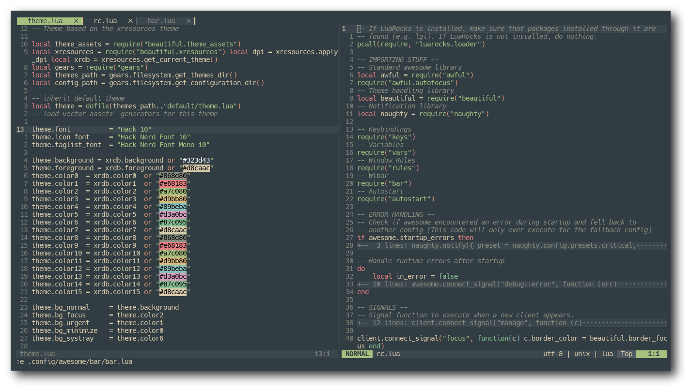

= https://neovim.io[Neovim]
Cha0t1c <notnotcha0t1c@protonmail.com>
{docdate}
:experimental:
:toc:

:IMPORTANT: Requires neovim nightly!

== Screenshots

== Plugins
|===
|Plugin|What it does

|https://github.com/wbthomason/packer.nvim[packer.nvim]
|Plugin manager

|https://github.com/romgrk/barbar.nvim[barbar.nvim]
|Fancy buffer bar

|https://github.com/sainnhe/everforest[everforest]
|Colorscheme

|https://github.com/junegunn/goyo.vim
|Distraction-free writing

|https://github.com/Yggdroot/indentLine[indentLine]
|Display indentation levels

|https://github.com/norcalli/nvim-colorizer.lua[nvim-colorizer.lua]
|Highlight colors

|https://github.com/nvim-treesitter/nvim-treesitter[nvim-treesitter]
|Highlighting and folding based on treesitter

|https://github.com/kyazdani42/nvim-tree.lua[nvim-tree.lua]
|File explorer tree

|https://github.com/junegunn/limelight.vim[limelight.vim]
|Hyperfocus-writing

|https://github.com/luochen1990/rainbow[rainbow]
|Rainbow parentheses

|https://github.com/tpope/vim-fugitive[vim-fugitive]
|Git wrapper

|https://github.com/airblade/vim-gitgutter[vim-gitgutter]
|Shows git changes

|===

== Keybindings
kbd:[Space] is set to the kbd:[Leader] key in this config, so if you want to use kbd:[Space] just use <leader>.

|===
|Keybinding|What it does

|kbd:[Ctrl+h]
|Move to split on the left

|kbd:[Ctrl+j]
|Move to split on the bottom

|kbd:[Ctrl+k]
|Move to split on the top

|kbd:[Ctrl+l]
|Move to split on the right

|kbd:[Space+s+v]
|Create vertical split

|kbd:[Space+s+h]
|Create horizontal split

|kbd:[Space+l]
|Go to next file

|kbd:[Space+h]
|Go to previous file

|kbd:[Space+s+p]
|Toggle spell checking (en_US)

|kbd:[Space+n]
|Open nvim-tree

|kbd:[Space+N]
|Find file in nvim-tree

|kbd:[Space+r]
|Refresh nvim-tree

|kbd:[Space+g]
|Toggle goyo

|kbd:[Ctrl+s]
|Magic buffer-picking mode

|kbd:[Alt+,]
|Move to previous buffer

|kbd:[Alt+.]
|Move to next buffer

|kbd:[Alt+<]
|Re-order buffer to previous

|kbd:[Alt+>]
|Re-order buffer to next

|kbd:[Alt+1-9]
|Switch buffers

|kbd:[Alt+c]
|Close buffer

|===

== Features
Stuff that wasn't mentioned in the other sections

* Clipboard that works between different applications
* Cursor line
* Custom statusline
* Don't show that tilde at the end of buffer
* Go through wrapped lines
* Not case sensitive in patterns
* Open splits below/on the right
* Removing trailing newlines and trailing whitespaces
* Show trailing whitespace
* Spaces! (over tabs)
