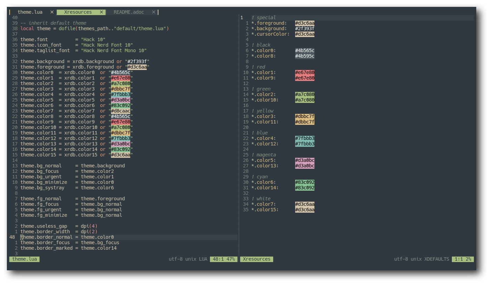

= https://neovim.io[Neovim]
v2, Cha0t1c <notnotcha0t1c@protonmail.com>
{docdate}
:experimental:
:toc:

== Screenshot
image:../../images/nvim.png[Neovim with fern and the neovim config open]

image:../../images/nvim3.png[Neovim with fish config open (with color preview)]
image:../../images/nvim4.png[Neovim dashboard]

== Plugins
|===
|Plugin|What it does

|https://github.com/Dimercel/todo-vim[todo-vim]
|Shows a todo list

|https://github.com/Yggdroot/indentLine[indentLine]
|Display indentation levels

|https://github.com/airblade/vim-gitgutter[vim-gitgutter]
|Shows git changes

|https://github.com/dag/vim-fish[vim-fish]
|Vim support for fish

|https://github.com/glepnir/dashboard-nvim[dashboard-nvim]
|Dashboard

|https://github.com/itchyny/lightline.vim[lightline.vim]
|Fancy bar at bottom

|https://github.com/junegunn/fzf.vim[fzf.vim]
|Fuzzy finding in vim

|https://github.com/lambdalisue/fern.vim[fern.vim]
|Tree viewer

|https://github.com/lambdalisue/fern-hijack.vim[fern-hijack.vim]
|Use fern instead of netrw

|https://github.com/lambdalisue/fern-git-status.vim[fern-git-status.vim]
|Git integration for fern

|https://github.com/lambdalisue/fern-renderer-nerdfont.vim[fern-renderer-nerdfont.vim]
|Icons in fern

|https://github.com/lambdalisue/nerdfont.vim[nerdfont.vim]
|Icons and stuff

|https://github.com/luochen1990/rainbow[rainbow]
|Rainbow parentheses

|https://github.com/mengelbrecht/lightline-bufferline[lightline-bufferline]
|Bufferline for lightline

|https://github.com/morhetz/gruvbox[gruvbox]
|Gruvbox colorscheme

|https://github.com/rrethy/vim-hexokinase[vim-hexokinase]
|Highlight colors

|===

== Keybindings
Leader key is Space.
|===
|Keybinding|What it does

|kbd:[Ctrl+h]
|Move to split on the left

|kbd:[Ctrl+j]
|Move to split on the bottom

|kbd:[Ctrl+k]
|Move to split on the top

|kbd:[Ctrl+l]
|Move to split on the right

|kbd:[Leader+s+v]
|Create vertical split

|kbd:[Leader+s+h]
|Create horizontal split

|kbd:[Leader+n]
|Go to next file

|kbd:[Leader+p]
|Go to previous file

|kbd:[Leader+N]
|Open fern

|kbd:[Leader+s+p]
|Toggle spell checking (en_US)

|kbd:[Leader+0-9]
|Switch buffers

|kbd:[Leader+0-9]
|Delete buffers

|kbd:[F5]
|Opens todo list

|===

== Features
Stuff that wasn't mentioned in the other sections

* A comment isn't placed when making an newline
* Clipboard that works between different applications
* Cursor line
* Don't show that tilde at the end of buffer
* Go through wrapped lines
* Not case sensitive in patterns
* Open splits below/on the right
* Removing trailing newlines and trailing whitespaces
* Show trailing whitespace
* Spaces! (over tabs)
