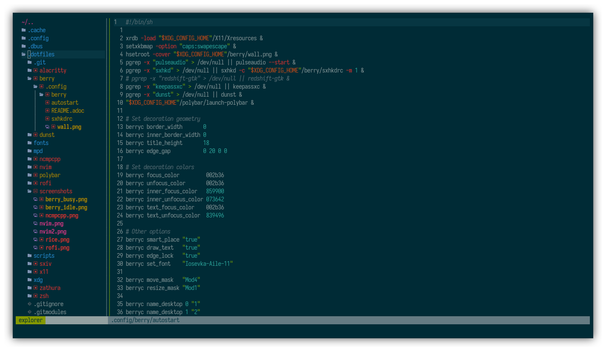
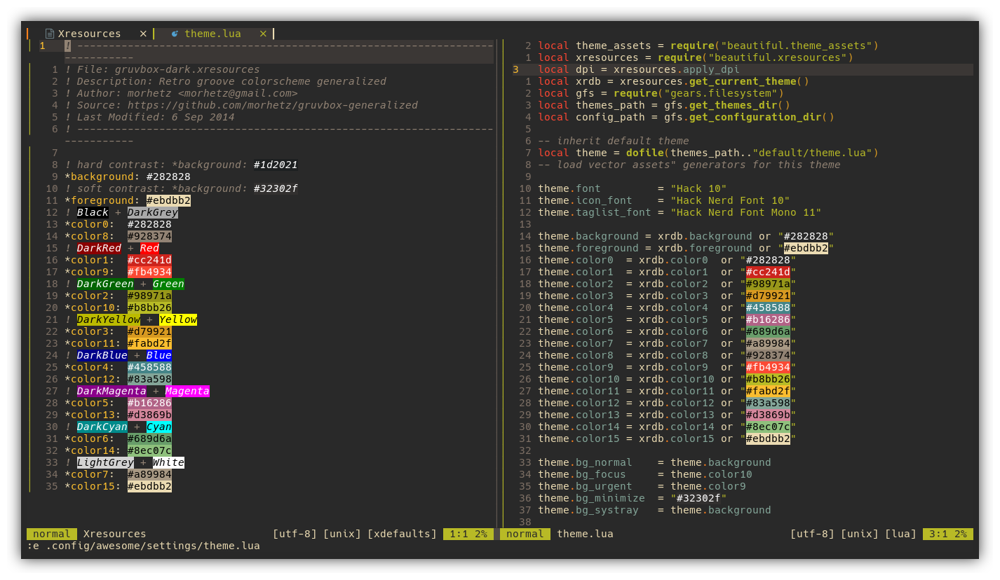

= https://neovim.io[neovim]
chtc <notnotcha0t1c@protonmail.com>
{docdate}
:toc: preamble
:experimental:

IMPORTANT: Requires neovim 0.5!

This config has only *one* purpose: editing the neovim config.

== Plugin List
|===
|Plugin|What it does
|https://github.com/wbthomason/packer.nvim[packer.nvim]
|Plugin manager

|https://github.com/romgrk/barbar.nvim[barbar.nvim]
|Fancy buffer bar

|https://github.com/lewis6991/gitsigns.nvim[gitsigns.nvim]
|Shows git changes

|https://github.com/lukas-reineke/indent-blankline.nvim[indent-blankline.nvim]
|Display indentation levels

|https://github.com/overcache/NeoSolarized[NeoSolarized]
|Colorscheme

|https://github.com/norcalli/nvim-colorizer.lua[nvim-colorizer.lua]
|Highlight colors

|https://github.com/kyazdani42/nvim-tree.lua[nvim-tree.lua]
|File explorer tree

|https://github.com/nvim-treesitter/nvim-treesitter[nvim-treesitter]
|Highlighting and folding based on treesitter

|https://github.com/p00f/nvim-ts-rainbow[nvim-ts-rainbow]
|Rainbow parentheses

|https://github.com/tpope/vim-fugitive[vim-fugitive]
|Git wrapper
|===

== Keybindings
Space is the leader key.

|===
|Keybinding|What it does

|kbd:[Ctrl+h]
|Move to split on the left

|kbd:[Ctrl+j]
|Move to split on the bottom

|kbd:[Ctrl+k]
|Move to split on the top

|kbd:[Ctrl+l]
|Move to split on the right

|kbd:[Space+s+v]
|Create vertical split

|kbd:[Space+s+h]
|Create horizontal split

|kbd:[Space+l]
|Go to next file

|kbd:[Space+h]
|Go to previous file

|kbd:[Space+s+p]
|Toggle spell checking (en_US)

|kbd:[Space+n]
|Open nvim-tree

|kbd:[Space+N]
|Find file in nvim-tree

|kbd:[Space+r]
|Refresh nvim-tree

|kbd:[Ctrl+s]
|Magic buffer-picking mode

|kbd:[Alt+,]
|Move to previous buffer

|kbd:[Alt+.]
|Move to next buffer

|kbd:[Alt+<]
|Re-order buffer to previous

|kbd:[Alt+>]
|Re-order buffer to next

|kbd:[Alt+1,2,3,4,5,6,7,8,9]
|Switch buffers

|kbd:[Alt+c]
|Close buffer
|===

== Features
Stuff that wasn't metioned in other sections.

* Clipboard that works between different applications
* Cursor line
* Custom statusline
* Don't show that tilde at the end of buffer
* Not case sensitive in patterns
* Open splits below on the right
* Removing trailing newlines and trailing whitespaces
* Show trailing whitespace
* Spaces! (over tabs)
